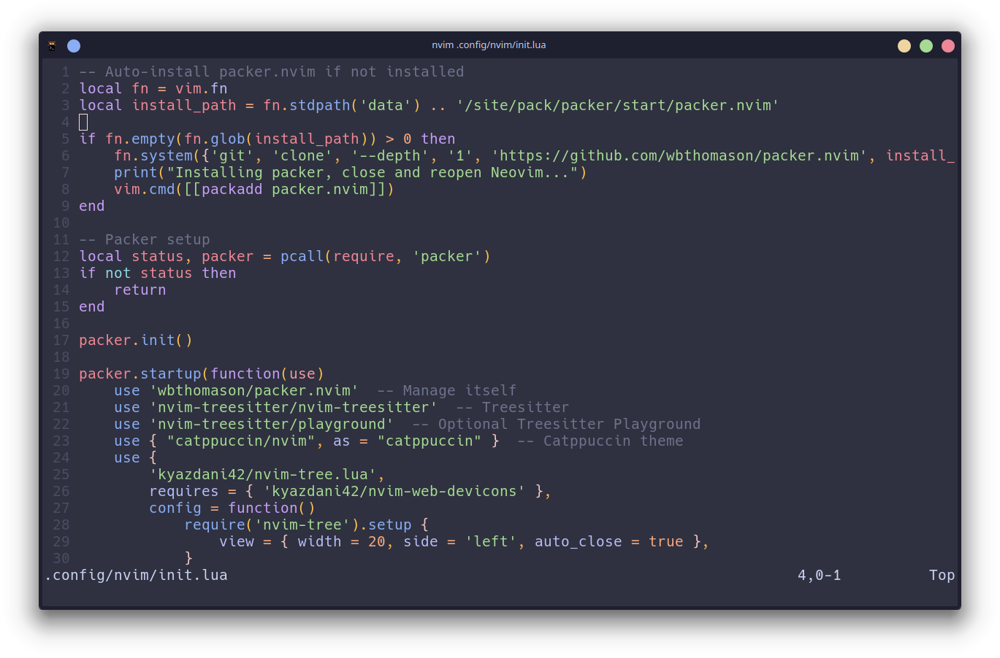
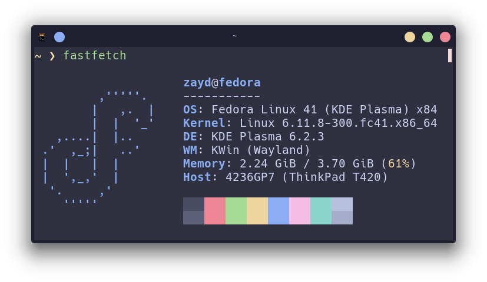
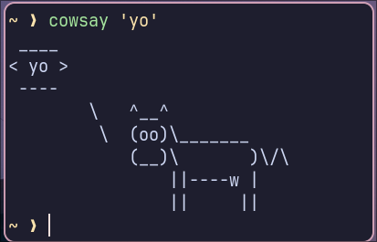

# My Customizations
Well, here's some customizations for YOU to modify!\
You can grab any of them, and adjust them however you like!\
I will put more things here later.\
Currently, I have:
## Neovim
A neovim init.lua, configured with the plugin manager "Packer", and the Neovim theme "Catppuccin Macchiato".\
Install Packer before getting the init.lua file.\
Make sure to run `:PackerSync` after getting the init.lua

## Fastfetch
Neofetch is no longer being maintained. So i moved to fastfetch. I have a very simple config.

## Rofi
The best application launcher. Similar to fastfetch, my Rofi config is very simple.\
If you're using Wayland, install the `rofi-wayland` package.

## Oh My ZSH!
I use ZSH as my shell. It's very customizable. So i decided to put a simple arrow theme. Works best with Catppuccin-Macchiato theme for your terminal.

## Kitty Terminal
One of my favourite terminal emulators. I left Konsole and moved on to kitty. I think i like it more. So here's my config.\
Make sure to install the Hack Nerd Font and Hack Nerd Font Bold from nerdfonts.com, as thats the font my config uses.

