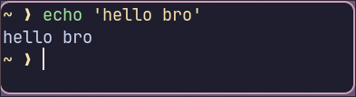
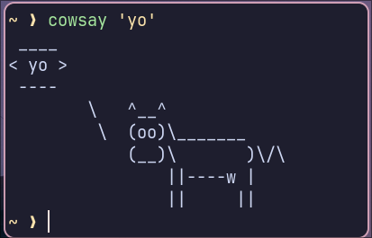
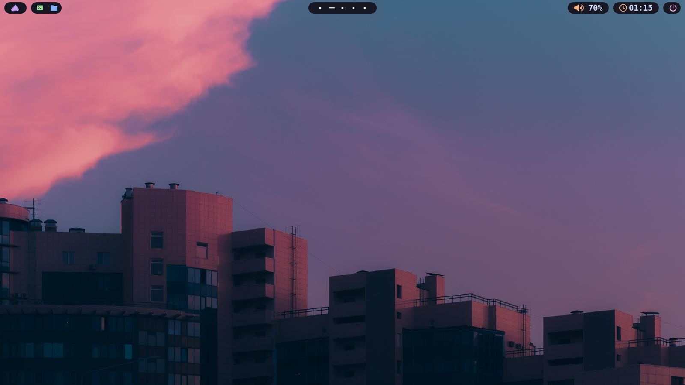
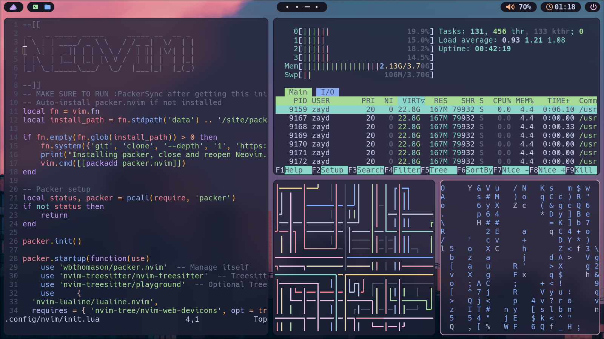
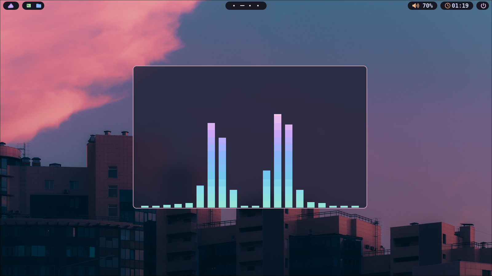

# My Customizations
Well, here's some customizations for YOU to modify!\
You can grab any of them, and adjust them however you like!\
I will put more things here later.\
Currently, I have:
## Neovim
A neovim init.lua, configured with the plugin manager "Packer", and the Neovim theme "Catppuccin Mocha".\
Install Packer before getting the init.lua file.\
Make sure to run `:PackerSync` after getting the init.lua

## Fastfetch
Neofetch is no longer being maintained. So i moved to fastfetch. I have a very simple config.

## Wofi
The best application launcher for Wayland. Similar to fastfetch, my Wofi config is very simple.\
I like it. It's cleeeeeeeeeean.

## Oh My ZSH!
I use ZSH as my shell. It's very customizable. So i decided to put a simple arrow theme. Works best with Catppuccin-Mocha theme for your terminal.

## Kitty Terminal
One of my favourite terminal emulators. I left Konsole and moved on to kitty. I think i like it more. So here's my config.\
Make sure to install the Hack Nerd Font and Hack Nerd Font Bold from nerdfonts.com, as thats the font my config uses.

## CAVA
Cava (CROSS PLATFORM AUDIO VISUALIZER) is a terminal program that can be used to create audio spectrums. It can also be configured. Here's mine:

# THE BIG ONE: HYPRLAND (+ waybar)
HYprland is a tiling WM. I love customizing it. Heres my config, i think you might like it. PLease be sure to read the wayba and hyprland config thoroughly, because this config was meant for MY system.

  
