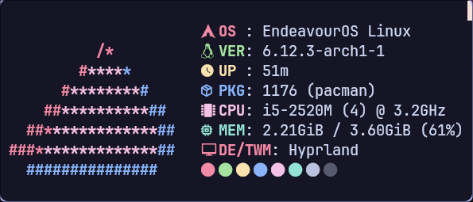
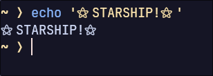
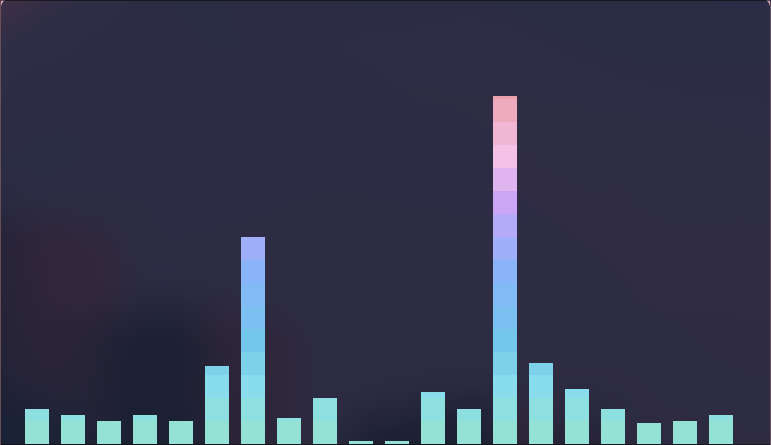

# My Customizations
Well, here's some customizations for YOU to modify!\
You can grab any of them, and adjust them however you like!\
Currently, I have:
## Neovim
A neovim init.lua, configured with the plugin manager "Packer", and the Neovim theme "Catppuccin Mocha", complete with a dashboard (alpha.nvim), fuzzy finder (telescope), file-tree with icons (nvim-tree), a beautiful catppuccin theme (mocha), and tree-sitter for syntax highlighting.\
Install Packer before getting the init.lua file.\
Make sure to run `:PackerSync` after getting the init.lua.\

## Neofetch
My favourite terminal "fetch" program.\
Yeah, it's not maintained anymore, but who cares? It's still great.\
Keep in mind that these logo colours are for endeavourOS specifically.\
Neofetch does not provide a small version of the endeavourOS logo.\
BUt you can use your own.
Thats why theres a `logo` file in the neovim folder.
Howeve, to use this logo, don't type `neofetch` in the terminal.\
Instead, type `neofetch --source ~/.config/neofetch/logo`\
That directory path assumes that you put the logo file in the neofetch folder.
You can alias this in your shells `.rc` file.\
THe colours in the logo are set to colour variables of your ACTUAL os.
So, if it doesn't show the endeavourOS colours, you must be using a different distro or something else.
For example, Arch LInux's logo is blue, so the logo provided in the file is blue.\
In that case, you can change the logo.

## Wofi
The best application launcher for Wayland. Similar to fastfetch, my Wofi config is very simple.\
I like it. It's cleeeeeeeeeean.

## Fish
My favourite shell.\
Thats all.

## Kitty
My favourite terminal emulator.

## Starship
THE prompt. The best prompt. My favourite prompt.

## CAVA
Cava (CROSS PLATFORM AUDIO VISUALIZER) is a terminal program that can be used to create audio spectrums. It can also be configured. Here's mine:

# THE BIG ONE: HYPRLAND (+ waybar)
HYprland is a tiling WM. I love customizing it. Heres my config, i think you might like it. PLease be sure to read the wayba and hyprland config thoroughly, because this config was meant for MY system.\
Now this has many tools that you need to install because i'm too lazy to make an install script for my dotfiles.
- `grim` and `slurp` for screenshotting
- `waybar` for the top bar
- `thunar` for the file manager
- `wofi` for the app launcher
- `kitty` for the terminal
- `swww` for the wallpaper utility
- `wlogout` for the logout menu (waybar)
- Bibata-Modern-Classic's both XCURSOR and HYPRCURSOR themes

(screenshots/hypr.png)
